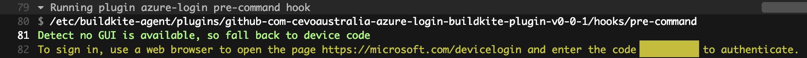

# Azure CLI Login plugin

A [Buildkite plugin](https://buildkite.com/docs/agent/v3/plugins) for logging into Azure CLI before running pipeline steps that want to interact with Azure

Currently it only supports interactive logins and identity-based logins.

If you are using interactive logins you will need to follow the instructions in the plugin output. 

e.g.


## Examples

The following pipeline will list all vms in the subscription after interactively logging in to the Azure CLI

```yml
steps:
  - command: "az vm list"
    plugins:
      - cevoaustralia/azure-login#v0.0.1: ~
```

If you want to use the identity of the agent instance to login:

```yml
steps:
  - command: "az vm list"
    plugins:
      - cevoaustralia/azure-login#v0.0.1:
            use-identity: true
```

## Configuration

### Optional

#### `use-identity` (boolean)

Log in to Azure using the agent instace's identity (passes `--identiy`) to `az login`